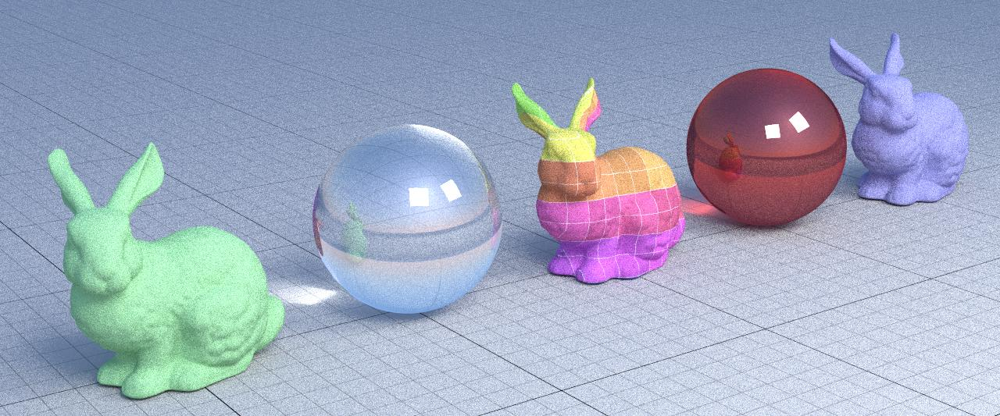
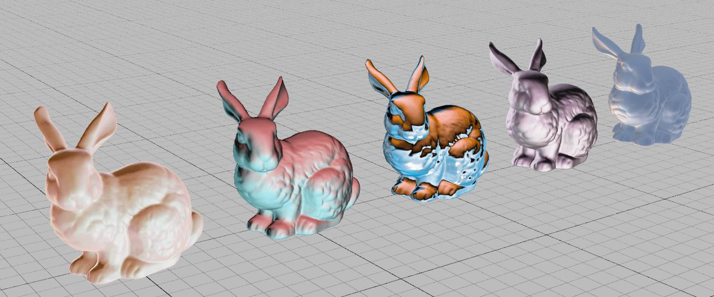
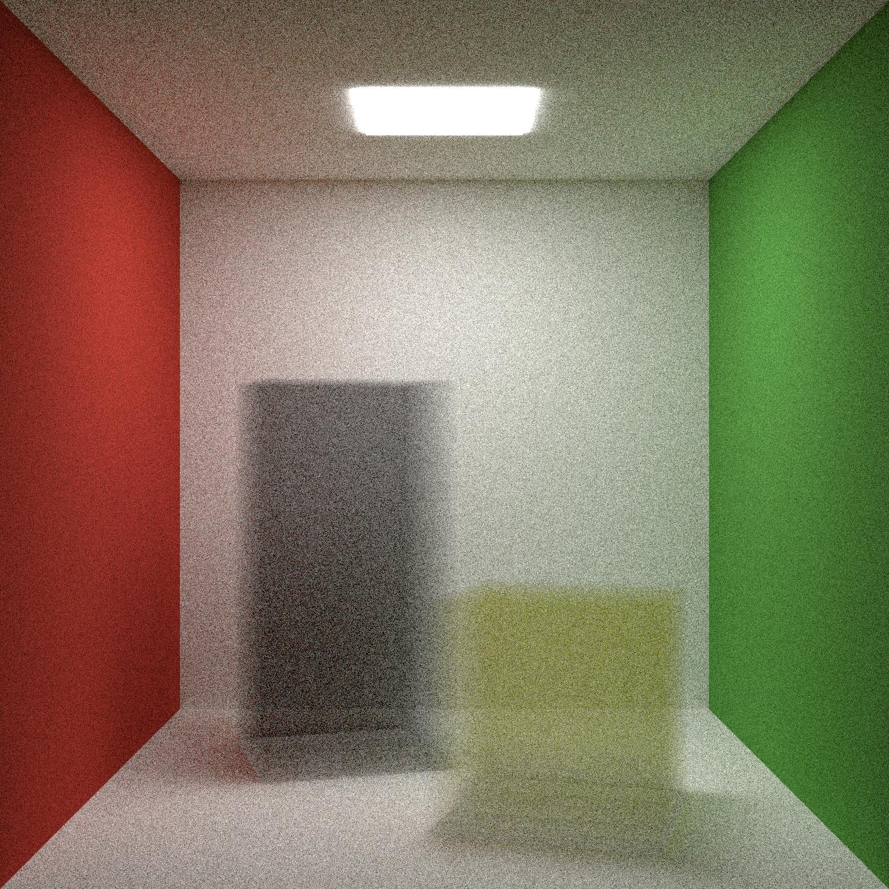

# homework 2 (computer graphics) 1919137 marco wang

# refractive (facile)
- cambiamo la normale e l'indice di rifrazione in base al raggio uscente o entrante 
dal mezzo trasmissivo(superficie dell'oggetto)

- viene deciso in base al suo indice di rifrazione se puo' essere rifratto, se non puo' essere rifratto viene rifratto, altrimenti il raggio viene riflesso

``` .\bin\yraytrace --scene tests\refract\refract.json --output out\extra\refract.jpg --samples 256 --bounces  8 --resolution 1280 ```



#  matcap (medio)
- mi trovo le coordinate rispetto alle coordinate della texture

- applico il colore che sta in quelle coordinate nella texture

``` .\bin\yraytrace --scene tests\15_matcap\matcap.json --output out\extra\0x_matcap_720_9.jpg --samples 9 --shader matcap --resolution 1280 ```


# volumetric (difficile)
- lancio un secondo raggio per potermi calcolare la distanza che c'e' tra una parete e l'altra (di un oggetto) in modo da potermi calcolare la distanza massima in cui far scatterare il mio raggio

- calcolo una distanza casuale proporzionale alla trasmittanza del materiale, piu' e' trasmittente piu sara' grande quindi attraversera' l'oggetto senza scatterare

- se la distanza e' minore della distanza fra una parete e l'altra allora vuol dire che non e' molto trasmissivo(abbastanza denso da far scatterare il mio raggio) e che quello sara' il punto in cui faro' scatterare il mio raggio con una direzione casuale. altrimento lo attraversa

```.\bin\yraytrace --scene tests\13_cornellboxvolumetric\cornellbox.json --output out\extra\13_cornellbox_512_256.jpg --samples 512 --resolution 1280 --bounces 8 ```
